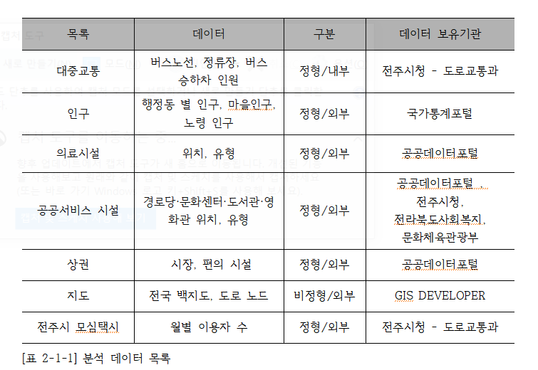
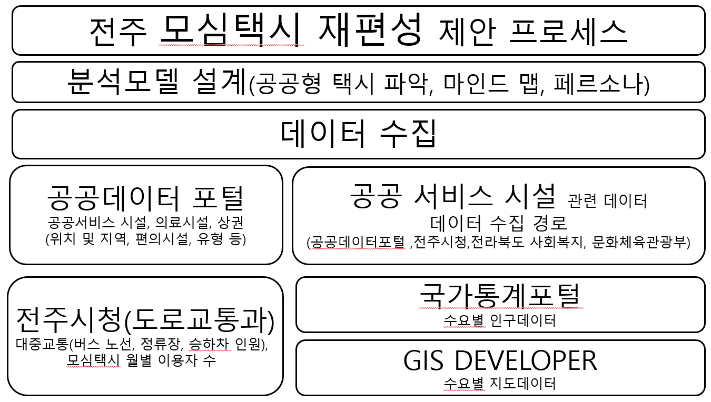
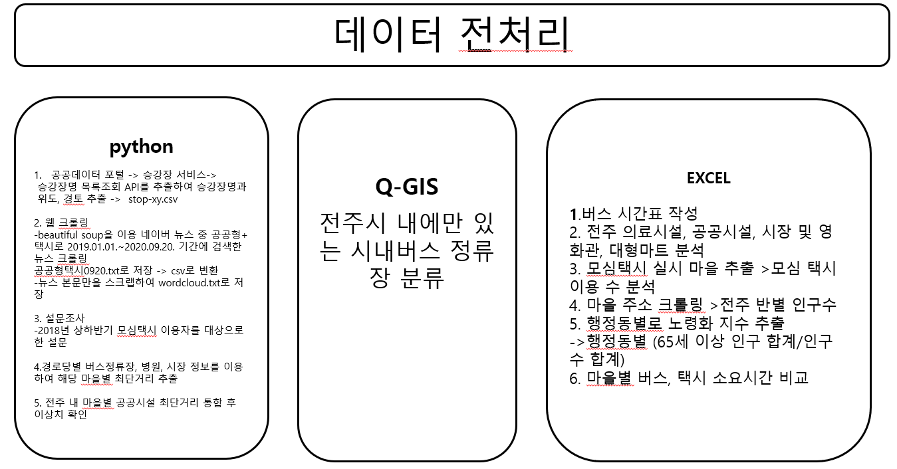
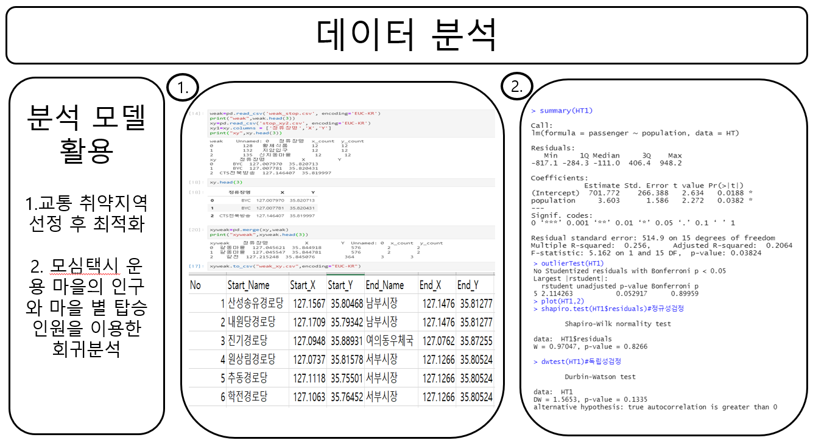
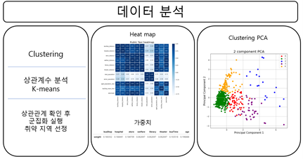
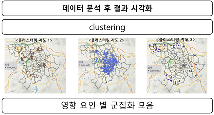
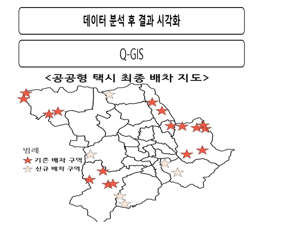

# 전주시 공공형 택시 최적입지 선정 프로젝트

### 공공형 택시?

버스 노선이 없거나 버스 정류장에서 거리가 멀어 대중교통 이용이 불편한 지역 주민들을 대상으로 택시비를 지원하는 사업.
이용자가 일정액을 부담하면 나머지 요금을 국비와 도비, 시·군비로 보조함

### 기획 배경

- 지속적으로 변화하는 전주시 버스 배차
- 모심 택시(전주시 공공형 택시)의 마을 선정 방식은 교통 사각지대를 해소하기에 너무 단순화 
- 거리와 배차조건에 적합한데도 선정되지 않은 마을 다수
- 전주시 고령화 비율
- 타 지역에 비해 부족한 전주시의 택시

## 1. 프로젝트 개요

### 프로젝트 목표

- 기존 모심택시 마을 선정 방식에 기반한 입지 선정 코드 개발
- 모심 택시 승강장 선정 기준의 확대 및 재조정을 통해서 교통 취약 지역에게 형평성 있는 교통편의를 제공

### 분석 목적 및 방향

- (교통 서비스 측면) 전주 시에서 교통 취약지역에 교통의 편의를 위해 전주시 공공형 택시를 운영 중이었으나, 사각지대에 놓인 교통 취약 지역 및 계층에게도 형평성 있는 교통편의를 제공하기 위해 재편성 필요성을 느낌.

- (이용자의 측면) 전주 시의 교통 취약 지역에 거주하는 주민의 건의 및 수요를 수렴하여 지자체 관계자의 측면에서 인지할 수 없는 부분을 보완하여 정책을 추진할 수 있음.

- (정책 활용 측면) 전주시 지차제의 정책 추진 방향과 이용자의 수요 방향을 신속⦁정확히 파악하고 명확한 사업 시행 기준을 판단하여 제한된 예산 내에서 효율적 수요응답형의 정책 시행이 가능해짐.   

### 분석 결과 활용 방안

- (교통 서비스 측면) 기존의 모심택시의 배차요건들의 한계점을 파악 후 재조정하여 최적화된 승강장 위치 선정 후 좀 더 편리한 교통 서비스를 제공.

- (이용자 측면) 존의 버스노선 개편 및 제시된 모심택시 운영으로 효율적인 모심택시 운행 및 이로 인한 지역 활성화와 도시재생에 기여

- (정책 활용 측면) 각 지역마다 다른 공공형 택시 운영에 통일성을 줄 수 있으며, 이를 통해 효율적인 정책 집행 가능

### 데이터

## 3. 분석 프로세스

### 프로젝트 설계 및 데이터 수집

### 데이터 전처리

### 데이터 분석

### 결과 시각화

### 최종 배치 지도

